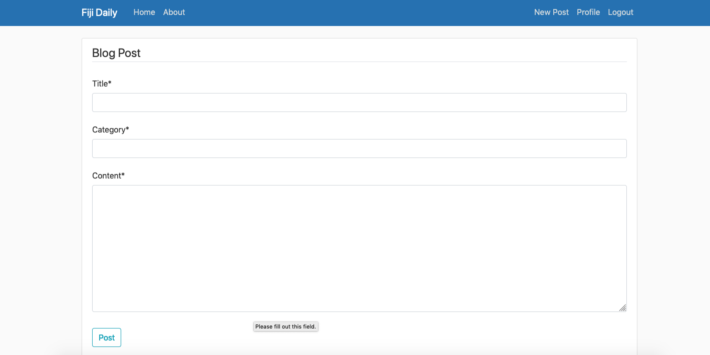

# FijiBlog

This was a website I made while studying

Specific Project Requirements:
Website should:
- contain several pages with navigation set up between pages.
- connect to a database containing the user posts. You are expected to create the database and populate it with test data.
- use consistent styling for the pages. You should select page layouts that are the most appropriate for the information.
- contain functionality to view and add posts. The website should also have authentication implemented as only 
  authenticated users can create posts.
  

