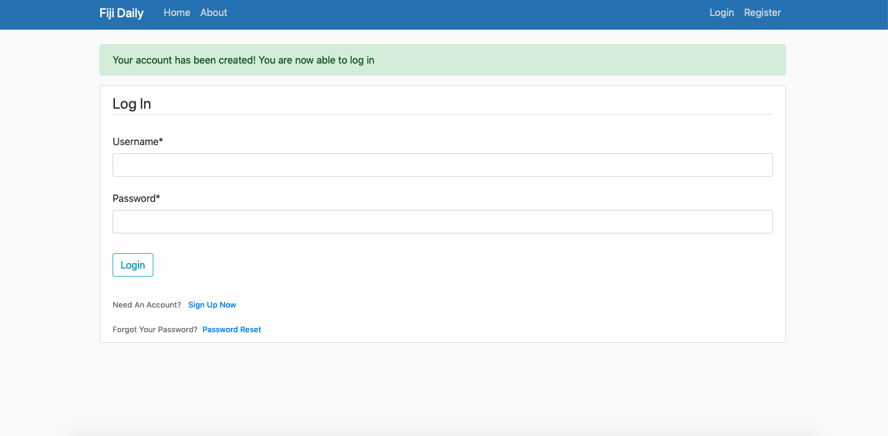

# FijiBlog

This is a blog style web app made with the django framework 

To run the web app on a mac:
use the following commands in the terminal one after another in the projects root directory ..
then type the url shown in the terminal in a browser

"source myenv/bin/activate" then..
"python manage.py runserver"

Note: Due to the permissions on the school computers i was unable to find a way to use djangos built in server to run the downloaded project on a windows machine. However i will give some suggested steps below.

Step 1: Open command prompt and navigate to where you want to store a virtual environment
Step 2: Make sure you have both pip and python installed
Step 3: Create a virtual environment - this website will show you how https://programwithus.com/learn-to-code/Pip-and-virtualenv-on-Windows/ 

Specific Project Requirements:
Website should:
- contain several pages with navigation set up between pages.
- connect to a database containing the user posts. You are expected to create the database and populate it with test data.
- use consistent styling for the pages. You should select page layouts that are the most appropriate for the information.
- contain functionality to view and add posts. The website should also have authentication implemented as only 
  authenticated users can create posts.
  

